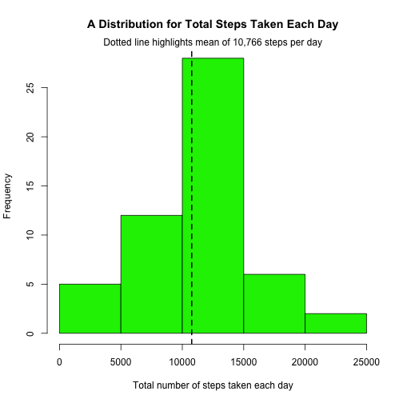
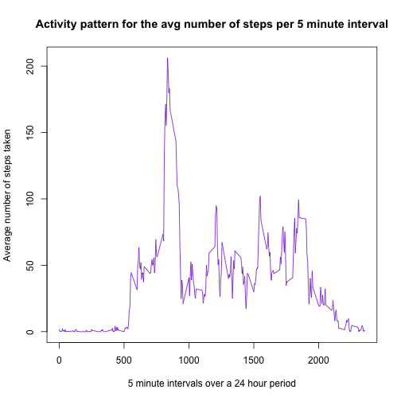
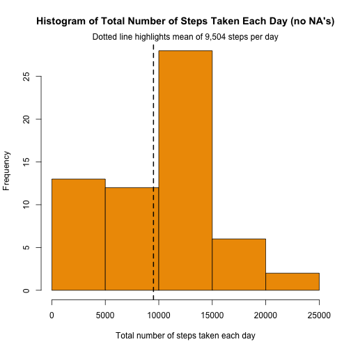
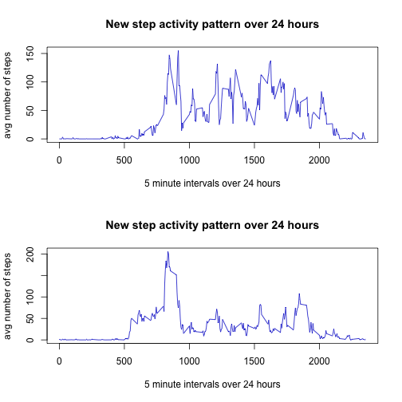

# Reproducible Research: Peer Assessment 1
  
  
## Loading and preprocessing the data

```r
library(plyr)
library(knitr)
library(lubridate)
library(stringr)
library(lattice)

download.file("https://d396qusza40orc.cloudfront.net/repdata%2Fdata%2Factivity.zip",
              destfile="data.zip", method="curl")
unzip("data.zip")
activity <- read.csv("activity.csv")
activity.grp <- aggregate(activity$steps, by=list(activity$date), FUN = "sum")
```

## What is mean total number of steps taken per day?
1. First, let's make a histogram of the total number of steps each day ignoring NA values.  


```r
hist(activity.grp$x, main = "A Distribution for Total Steps Taken Each Day", xlab = "Total number of steps taken each day", col = "green2")
abline(v = mean(activity.grp$x, na.rm = TRUE), col=1, lty=2, lwd=2)
mtext("Dotted line highlights mean of 10,766 steps per day", side = 3) 
```

 

2. What is the mean number of steps taken per day?  


```r
print(mean(activity.grp$x, na.rm = TRUE))
```

```
## [1] 10766
```
3.  What is the median total number of steps taken per day?  


```r
print(median(activity.grp$x, na.rm = TRUE))
```

```
## [1] 10765
```
## What is the average daily activity pattern?  


```r
daily <- aggregate(steps ~ interval, data = activity, FUN = mean)
plot(daily, type = "l", xlab = "5 minute intervals over a 24 hour period", ylab = "Average number of steps taken", 
     main = "Activity pattern for the avg number of steps per 5 minute interval", col = "purple3")
```

 

Which 5-minute interval, on average across all the days in the dataset, contains the maximum number of steps?  


```r
daily$interval[which.max(daily$steps)]
```

```
## [1] 835
```

## Imputing missing values
1. Calculate and report the total number of missing values in the dataset (i.e. the total number of rows with NAs).


```r
sum(is.na(activity))
```

```
## [1] 2304
```

2. My strategy to fill in the missing data values is with the median of each interval  


```r
##  Calculate the median and if NA, replace NA with the median in the steps column
impute.median <- function(x) replace(x, is.na(x), median(x, na.rm = TRUE))

newActivity <- ddply(activity, ~ interval, transform, steps = impute.median(steps))

new.df.grp <- aggregate(newActivity$steps, by=list(newActivity$date), FUN = "sum")


hist(new.df.grp$x, main = "Histogram of Total Number of Steps Taken Each Day (no NA's)", xlab = "Total number of steps taken each day", col ="orange2")
abline(v = mean(new.df.grp$x, na.rm = TRUE), col=1, lty=2, lwd=2)
mtext("Dotted line highlights mean of 9,504 steps per day", side = 3)
```

 

3. What is the mean number of steps taken per day?  


```r
print(mean(new.df.grp$x, na.rm = TRUE))
```

```
## [1] 9504
```

4. What is the median number of steps taken per day?  


```r
print(median(new.df.grp$x, na.rm = TRUE))
```

```
## [1] 10395
```
## Are there differences in activity patterns between weekdays and weekends?  

1. Create a new factor variable in the dataset with two levels – “weekday” and “weekend” indicating whether a given date is a weekday or weekend day.


```r
newActivity$date <- as.Date(newActivity$date)
for (date in newActivity) {
    newActivity$DayType <- (as.POSIXlt(newActivity$date)$wday %% 6  == 0)   
}
newActivity$DayType <- factor(newActivity$DayType, labels = c("weekday", "weekend"))
```

2. Make a panel plot containing a time series plot (i.e. type = "l") of the 5-minute interval (x-axis) and the average number of steps taken, averaged across all weekday days or weekend days (y-axis).  


```r
par(mfrow = c(2,1))

for (type in c("weekend", "weekday")) {
        newDaily <- aggregate(steps ~ interval, data = newActivity, subset = newActivity$DayType == 
                                        type, FUN = mean)
        plot(newDaily, type = "l", xlab = "5 minute intervals over 24 hours", ylab = "avg number of steps", main = "New step activity pattern over 24 hours", col = "blue3")
}
```

 
